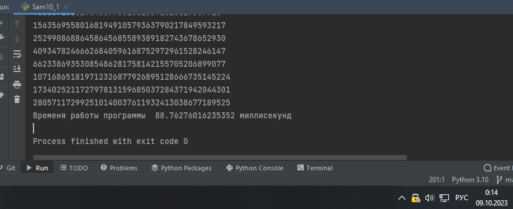
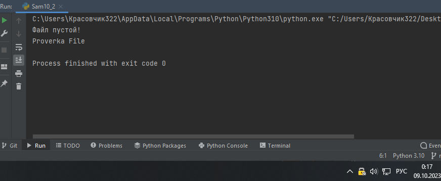
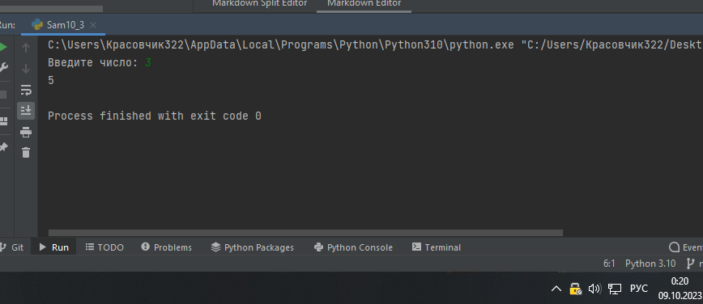
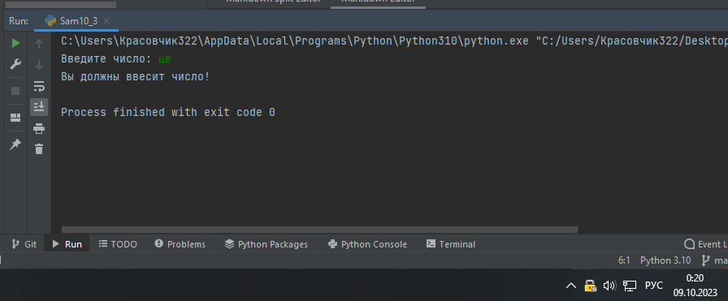
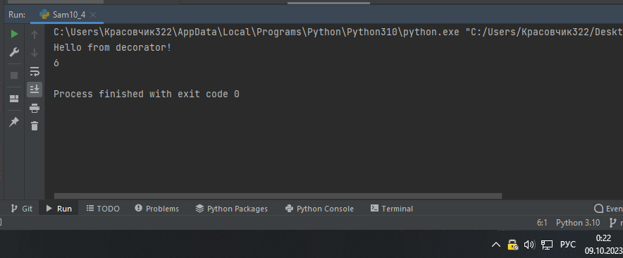
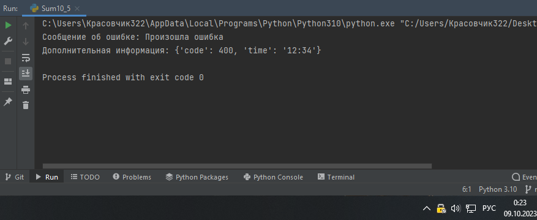

Самостоятельная работа 10


Прокопчук Виталий Сергеевич

ЗПИЭ 20-1


| Задание   | Лаб_раб | Сам_раб |
| ------------------ | --------------- | --------------- |
| Задание 1 | -             | +             |
| Задание 2 | -             | +             |
| Задание 3 | -             | +             |
| Задание 4 | -             | +             |
| Задание 5 | -             | +             |
|                  |               |               |
|                  |               |               |
|                  |               |               |
|                  |               |               |
|                  |               |               |

Работу проверили:

* к.э.н., доцент Панов М.А.

Задание 1

Вовочка решил заняться спортивным программированием на
python, нодля этого он должен
знать за какое время выполняется его программа.Он решил, что для этого ему идеально подойдет декоратор дляфункции, который будет выяснять за какое
время выполняется та илииная
функция. Помогите Вовочке в его начинаниях и напишите такойдекоратор.

Подсказка: необходимо использовать модуль timeДекораторнеобходимоиспользоватьдляэтойфункции

Результатомвашейработыбудетлистингкодаискриншот
консоли,в

котором будет
выполненная функция Фибоначчи и время выполненияпрограммы.

Также на
этом примере можете посмотреть, что решение задач черезрекурсию не всегда является хорошей идеей. Поскольку решениеФибоначчи для 100 с использованием
рекурсии и без динамическогопрограммирования
решается более десяти секунд, а решение точно
такой же задачи, но через цикл for еще и для 200, занимает меньше 1секунды.

Решение

```
import time
def fibonacci():
    start = time.time()
    fib1 = fib2 = 1

    for i in range(2, 200):
        fib1, fib2 = fib2, fib1 + fib2
        print(fib2)
    end = time.time()
    print("Временя работы программы ",(end-start) * 10**3, "миллисекунд")

if __name__ == "__main__":

    fibonacci()
```



Вывод

Импортируем модуль time

Создаем функцию для вычисления числа фибоначи

Используем модуль time для определения сколько работает наша программа.

Задание 2

Посмотрев
на Вовочку, вы также загорелись идеей спортивногопрограммирования, начав тренировки вы узнали, что для решениянекоторых задач необходимо считывать
данные из файлов. Но черезнекоторое
время вы столкнулись с проблемой что файлы бываютпустыми, и вы не получаете вводные данные для решения задачи.После этого вы решили не просто считывать
данные из файла, а всюконструкциюоборачиватьвисключения,чтобыизбежатьтакой

проблемы. Создайте пустой файл и файл, в котором
есть какая-тоинформация. Напишите
код программы. Если файл пустой, то, нужновызвать
исключение (“бросить исключение”) и вывести в консоль“файлпустой”,аеслионнепустой,
товывестиинформациюизфайла

Решение

```
import os

a = os.stat("text.txt").st_size == 0
if a == True:
    print("Файл пустой! ")

b = os.stat("text1.txt").st_size == 0
if b == False:
    file = open("text1.txt", "r")
    print(*file)
```



Вывод

Импортируем модуль os

Проверяем пустой ли файл и выводим что файл пустой

Если файл не пустой выводим проверка файла

Задание 3

Напишите функцию, которая будет складывать 2 и
введенноепользователем число, но
если пользователь введет строку или другойнеподходящий
тип данных, то в консоль выведется ошибка“Неподходящий
тип данных. Ожидалось число.”. Реализоватьфункционал
программы необходимо через try/except и подобратьправильный тип исключения. Создавать собственное исключениенельзя. Проведите несколько тестов, в
которых исключение вызываетсяи
нет. Результатом выполнения задачи будет листинг кода иполучившийсявывод в
консоль

Решение

```
try:
    a = 2
    b = int(input("Введите число: "))
    c = a + b
    print(c)
except ValueError:
    print("Вы должны ввесит число!")

```




Вывод

При помощи try except создаем исключение если у нас появляется ошибка ValueError которая проверяет ввел ли пользователь правильный тип дланных

Задание 4

Создайте собственный декоратор, который будет

использоваться длядвух любых вами
придуманных функций. Декораторы, которыеиспользовались
ранее в работе нельзя воссоздавать. Результатомвыполнения задачи будет: класс декоратора, две как-то связанными
сним функциями, скриншот консоли с
выполненной программой иподробные
комментарии, которые будут описывать работу вашегокода.

Решение

```
def hello_decorator(f):
    #создаем функцию
   @wraps(f)
   def wrapper(*args, **kwargs):
#Аргументы функции wrapper(): *args и **kwargs. Аргумент *args собирает позиционные аргументы, а **kwargs — именованные
       print('Hello from decorator!')
#В первой строке тела функции wrapper() в консоль выводится «Hello from decorator!» — единственный «побочный эффект»
       return f(*args, **kwargs)
#Например, в вызове: wrapper(1, ‘a’, x=5, y=None) значение args — кортеж (1, ‘a’),
# а kwargs — словарь {‘x’: 5, ‘y’: None}. Если позиционных аргументов при вызове функции нет, args — пустой,
# и если нет именованных аргументов, пустой — kwargs

   return wrapper
#В последней строке функции hello_decorator() возвращаем функцию-обертку wrapper().
# Так мы указываем, что нужно подставить на место декорируемой функции f(). Вызывать функцию wrapper() не нужно — возвращаем саму функцию

@hello_decorator
def sum2(a, b):
   return a + b

print(sum2(1,5))
```



Задание 5

Создайте собственное исключение, которое будет использоваться вдвух любых фрагментах кода. Исключения, которые использовалисьранее в работе нельзя воссоздавать.

Результатом выполнения задачибудет:
класс исключения, код к котором в двух местах используется этоисключение, скриншот консоли с
выполненной программой иподробныекомментарии,которыебудутописывать
работувашегокода.

Решение

```
class MyCustomException(Exception):
    def __init__(self, message, extra_info):
        super().__init__(message)
        self.extra_info = extra_info

try:
    raise MyCustomException("Произошла ошибка", {"code": 400, "time": "12:34"})
except MyCustomException as e:
    print(f"Сообщение об ошибке: {e}")
    print(f"Дополнительная информация: {e.extra_info}")

```


