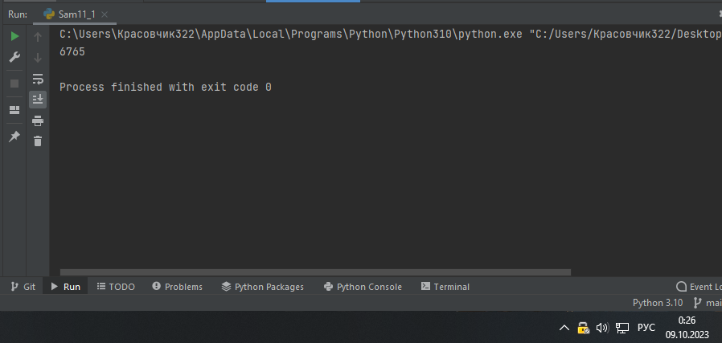
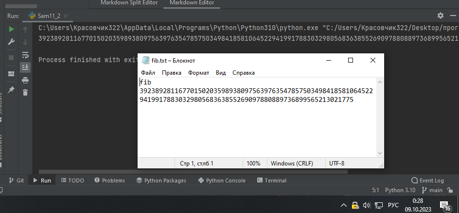

Самостоятельная работа 11

Прокопчук Виталий Сергеевич

ЗПИЭ 20-1


| Задание   | Лаб_раб | Сам_раб |
| ------------------ | --------------- | --------------- |
| Задание 1 | -             | +             |
| Задание 2 | -             | +             |
|                  |               |               |
|                  |               |               |
|                  |               |               |
|                  |               |               |
|                  |               |               |
|                  |               |               |
|                  |               |               |
|                  |               |               |

Работу проверили:

* к.э.н., доцент Панов М.А.

Задание 1

Вас никак не могут оставить числа Фибоначчи, очень уж они васзаинтересовали. Изучив новые возможности Python вы решилиреализовать программу, которая считает

числа Фибоначчи припомощи
итераторов. Расчет начинается с чисел 1 и 1. Создайтефункциюfib(n),генерирующуюnчиселФибоначчи
сминимальными затратами
ресурсов. Для реализации этой функциипотребуется
обратиться к инструкции yield (Она не сохраняет воперативной памяти огромную последовательность, а даетвозможность “доставать” промежуточные
результаты по одному).Результатом
решения задачи будет листинг кода и вывод в консоль счислом Фибоначчи от 200.

Решение

```
def fib(n):
    fib0 = 1
    yield fib0
    fib1 = 1
    yield fib1
    for i in range(n - 2):
        fib0, fib1 = fib1, fib0 + fib1
        yield fib1


# Тест
for num in fib(20):
    pass
print(num)
```



Вывод

Выполняем подсчет числа фибоначи того числа которое задаст нам пользователь


Задание 2

К коду предыдущей задачи добавьте запоминание каждого
числаФибоначчи в файл “fib.txt”, при
этом каждое число должнонаходиться
на отдельной строчке. Результатом выполнения задачибудетлистингкодаи
скриншотполучившегосяфайла

Решение

```
def fib(n):
    fib0 = 1
    yield fib0
    fib1 = 1
    yield fib1
    for i in range(n - 2):
        fib0, fib1 = fib1, fib0 + fib1
        yield fib1


# Тест
for num in fib(2315612):
    pass
print(num)
f = open("fib.txt", "w")
f.write(f"fib {num}")
```




Вывод

Добавляем к коду из 1 задание возможность записи полученного числа в файл
