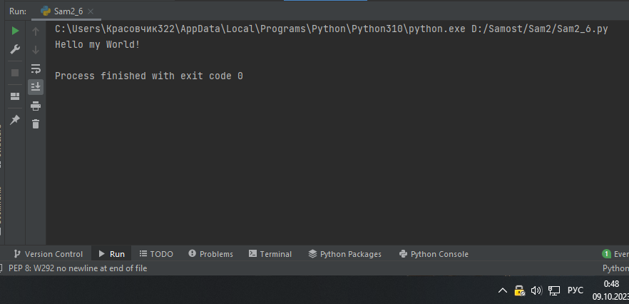

Самостоятельная работа 2

Прокопчук Виталий Сергеевич

ЗПИЭ 20-1


| Задание    | Лаб_раб | Сам_раб |
| ------------------- | --------------- | --------------- |
| Задание 1  | -             | +             |
| Задание 2  | -             | +             |
| Задание 3  | -             | +             |
| Задание 4  | -             | +             |
| Задание 5  | -             | +             |
| Задание 6  | -             | +             |
| Задание 7  | -             | +             |
| Задание 8  | -             | +             |
| Задание 9  | -             | +             |
| Задание 10 | -             | +             |

Задание 1

Выведите в консоль булевую переменную False, не используя слово False в строке илиизначально присвоенную булевую переменную.

Программа должна занимать не более двухстрокредактора
кода.

Решение

```
a = 2>3
print(bool(a))
```


Вывод

Проверяем истинно ли выражение и выводим его в консоль

Задание 2

Присвоить значения трем переменным и вывести их в консоль, используя только две строкиредакторакода

Решение

```
a = 2;  b = 3;  c = "12"
print(a,b,c)
```


Вывод

Присваивать значение нескольким переменным можно перечисляя их через ;

Задание 3

Реализуйте
ввод данных в программу, через консоль, в виде только целых чисел (тип данныхint). То есть при вводе буквенных
символов в консоль, программа не должна работать.Программадолжназанимать неболеедвухстрок редакторакода

Решение

```
a = int(input('Введите число'))
print(a)
```


Вывод

При запросе данных от пользователя тип данных автоматически становиться строковым, поэтому нужно использовать int для перевода данных в число.

Задание 4

Создайте
только одну строковую переменную. Длина строки должна не превышать 5символов. На выходе мы должны получить
строку длиной не менее 16 символов. Программа
должназанимать неболее
двух строкредакторакода.

Решение

```
a = "Salam"
print(a)
```


Вывод

Вывод строки через функцию print

Задание 5

Создайте
три переменные: день (тип данных - числовой), месяц (тип данных - строка), год(тип данных - числовой) и выведите в
консоль текущую дату в формате: “Сегодня день месяцгод. Всего хорошего!” используя F строку и оператор end внутри
print(), в котором вы должнынаписать
фразу “Всего хорошего!”. Программа должна занимать не более двух строкредактора
кода

Решение

```
a = 25; b = "сентября"; c = 2023
print(f"Сегодня {a} {b} {c}. Всего хорошего!")
```


Вывод

При помощи f строк можно вызывать переменные внутри другого кода

Задание 6

В предложении ‘Hello World’ вставьте ‘my’ между двумя словами. Выведите

полученноепредложение в консоль в
одну строку. Программа должна занимать не более двух строкредактора
кода.

Решение

```
a = "Hello"; b = "World!"; c = " my "
print(a + c + b)
```



Вывод

Строки можно складывать между собой

Задание 7

Узнайте длину предложения ‘Hello World’, результат выведите в консоль. Программа должназаниматьнеболеедвух строкредакторакода.

Решение

```
a = "Hello wold!"
print(len(a))
```


Вывод

При помощи len можно узнать друну строки.

Задание 8

Переведите предложение ‘HELLO WORLD’ в нижний регистр. Программа должна заниматьнеболеедвух строкредакторакода.

Решение

```
a = " HELLO WORLD"
print(a.lower())
```


Вывод

При помощи метода lower можно перевести строку в нижний регистр.

Задание 9

Самостоятельно придумайте задачу по проходимой теме и
решите ее. Задача должна бытьсвязаннасо взаимодействием счисловыми значениями.

Решение

```
a = 54; b = 2
print(a * b)
```


Вывод

Можно делать любимые арифметические задачи

Задание 10

Самостоятельно придумайте задачу по проходимой теме и
решите ее. Задача должна бытьсвязаннасо взаимодействием со строковымизначениями.

Решение

```
a = input("Виталий")
print(f"Меня зовут {a}! ")
```


Вывод

Запросив данные от пользователя можно так же использовать f строки
