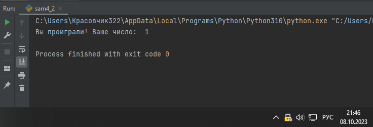
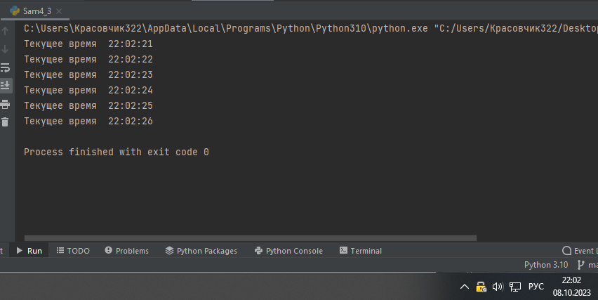
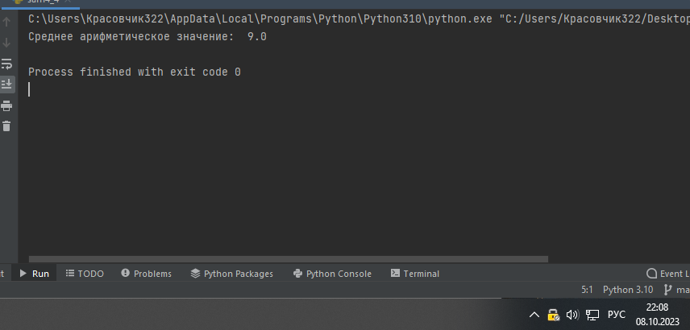
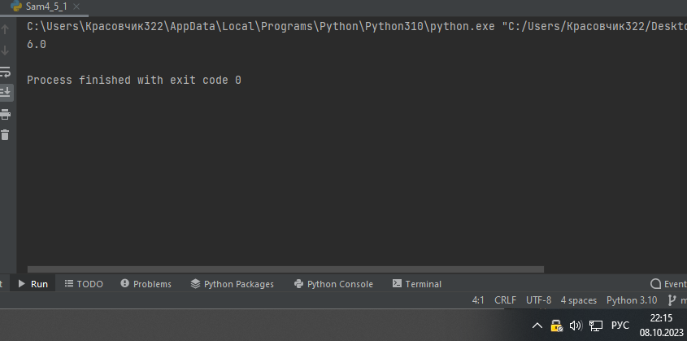

Самостоятельная работа 4


Прокопчук Виталий Сергеевич

ЗПИЭ 20-1


| Задание   | Лаб_раб | Сам_раб |
| ------------------ | --------------- | --------------- |
| Задание 1 | -             | +             |
| Задание 2 | -             | +             |
| Задание 3 | -             | +             |
| Задание 4 | -             | +             |
| Задание 5 | -             | +             |
|                  |               |               |
|                  |               |               |
|                  |               |               |
|                  |               |               |
|                  |               |               |

Работу проверили:

* к.э.н., доцент Панов М.А.

Задание 1

Дайте
подробный комментарий для кода, написанного ниже.Комментарий нужен для каждой строчки кода, нужно описать что онаделает.
Незабудьте,чтофункциикомментируютсяпо-особенно

Решенеие

```
from datetime import  datetime
# импорт из библиотеки datetime модуля datetime
from math import sqrt
# импорт из библиотеки math модуля sqrt


def main(**kwargs):
    # создание функции с аргументом **kwargs
    for key in kwargs.items():
        # цикл for in
        result = sqrt(key[1][0] ** 2 + key[1][1] ** 2)
        # создание переменной и вычисление ее пораметров
        print(result)
        # вывести в консоль результат вычисления переменной


if __name__ == "__main__":
    # проверка запускаем ли мы основной файл
    start_time = datetime.now()
    # создание переменной с использывание библиотеки
    main(
        # запуск функции
        one=[10,3],
        two=[5,4],
        three=[15,13],
        # значение аргументов функции
    )
    time_costs = datetime.now() - start_time
    # определение времени выполнения программы
    print(f'Время выполнения программы - {time_costs}')
    # вывод в консоль сколько времени потраченно на выполнение команды
```

Задание 2

Напишите программу, которая будет заменять игральную кость с 6гранями. Если значение равно 5 или 6, то в консоль выводится «Выпобедили», если значения 3 или 4, то вы рекурсивно должны вызвать эту же функцию, если значение 1 или 2, то в консоль выводится «Выпроиграли». При этом каждый вызов функции необходимо выводить вконсользначение

“кубика”.Длявыполнениязадания необходимоиспользовать стандартную библиотеку random.
Программу нужнонаписать,используяоднуфункцию и“точку
входа

Решение

```
import random


def Kub():
    while True:
        a = random.randint(1, 6)
        if a >= 5:
            print("Вы победили! Ваше число: ", a)
            break

        elif a <= 4 and a >= 3:
            print("Кубик перебрасывается! Ваше число: ", a)
            continue

        else:
            print("Вы проиграли! Ваше число: ", a)
            break


Kub()

```



Вывод

Импортируем библиотеку random. Создаем функцию Kub, переменную "а" которая будет нашим ребром куба. Запускаем цикл и присваиваем переменной "а" рандомное значение, если число больше или равно 5, то мы победили, если число меньшеили равно 4 и больше или равно 3 то перебрасываем кубик, иначе выводим что мы проиграли и выходим из цикла

Задание 3

Напишите программу, которая будет выводить текущее
время, сточностью до секунд на
протяжении 5 секунд. Программу нужнонаписать
с использованием цикла. Подсказка: необходимо
использовать модуль datetime и time, а также вам необходимо как-то“усыплять”программу на 1секунду.

```
from datetime import datetime
import time
def taimer(a):
    count = 0
    while a >= count:
        now = datetime.now()
        newtime = now.strftime("%H:%M:%S")
        print("Текущее время ", newtime)
        time.sleep(1)
        count += 1

taimer(5)

```



Вывод

Импортируем мобуль datetime и time.

Создаем функцию taimer с аргументом "а" который будет отвечать сколько секунд нужно отсчитать. Создаем счетчик и запускаем цикл в котором создаем переменную с значением текущего времени "now" с параметрами часы минуты и секунды, выводим текущее время с делаем задержку в 1 секунду и увеличиваем счетчик на 1.

Задание 4

Напишите программу, которая считает среднее

арифметическое отаргументов
вызываемое функции, с условием того, что изначальноеколичество этих аргументов неизвестно. Программу необходимореализоватьиспользуяоднуфункцию и “точкувхода”.

Решение

```
import random

def avg(len_num):
    sum = 0
    len_num = 0
    num_list = [0]
    while len(num_list) < len_num:
        num_list.append(random.randint(0,10))
        print(num_list)
    for i in num_list:
        i = random.randint(0,10)
        sum += i
        cred_sum = sum / len(num_list)
        print("Среднее арифметическое значение: ", cred_sum)
avg(7)
```



Вывод

Импортируем модуль random. Создаем функцию avg с аргементом len_num (отвечает за длину списка). создаем нужные переменные "sum" "len_num" "num_list". Запускаем цикл while и заполняем наш список случайными значениями. При помощи цикла for in и дополнительной переменной cred_sum считаем среднее арифметическое значение путем сложения всех элементов нашего списка и деления на его длину.

Задание 5

Создайте два Python файла, в одном будет выполняться

вычислениеплощади треугольника при
помощи формулы Герона (необходимореализовать
через функцию), а во втором будет происходить
взаимодействие с пользователем (получение всей необходимойинформации и вывод результатов). Напишите
эту программу ивыведитевконсоль
полученную площадь.

Решение

1 файл

```
def area(a,b,c):
    s = (a + b + c ) / 2
    area = (s*(s-a)*(s-b)*(s-c)) ** 0.5
    print(area)
```

2 файл

```
from Sam4_5_2 import area

area(3,4,5)

```



Вывод

В первом файле создаем функцию с 3 аргументами которые будут отвечать за длину каждой грани треугольника. В самой функции используя эти аргументы мы высчитываем площадь треульгоника.

Во втором файле мы импортируем функцию с первого файла и подставляем в аргументы значения которые нам необходимы.
