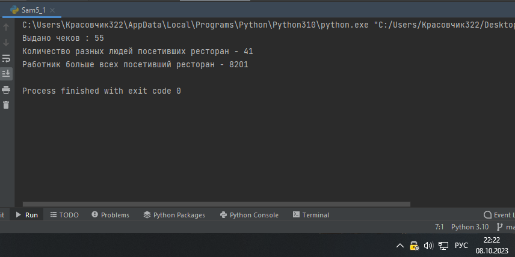
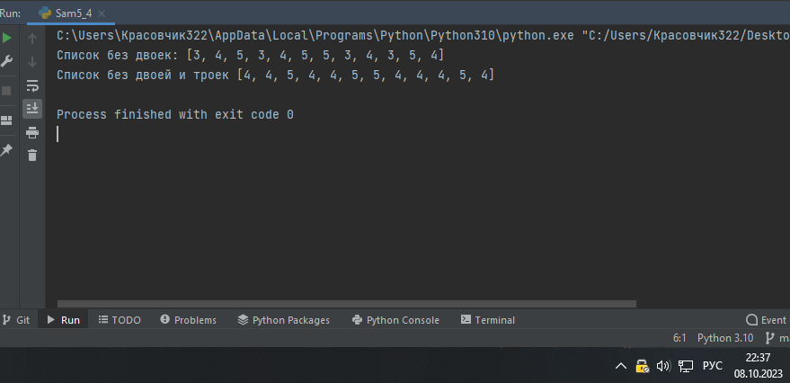

Самостоятельная работа 5


Прокопчук Виталий Сергеевич

ЗПИЭ 20-1


| Задание   | Лаб_раб | Сам_раб |
| ------------------ | --------------- | --------------- |
| Задание 1 | -             | +             |
| Задание 2 | -             | +             |
| Задание 3 | -             | +             |
| Задание 4 | -             | +             |
| Задание 5 | -             | +             |
|                  |               |               |
|                  |               |               |
|                  |               |               |
|                  |               |               |
|                  |               |               |

Работу проверили:

* к.э.н., доцент Панов М.А.

Задание 1

Ресторан на

предприятии ведет учет посещений за неделю при помощикода работника. У них есть список со всеми посещениями за
неделю.Вашазадача почитать:

·
Сколькобыловыдано
чеков

·
Сколькоразныхлюдейпосетилоресторан

·
Какой работник посетил ресторан больше всех разСписок
выданных чековза неделю:

[8734,2345,8201,6621,9999,1234,5678,8201,8888,4321,3365,

1478,9865,5555,7777,9998,1111,2222,3333,4444,5556,6666,

5410,7778,8889,4445,1439,9604,8201,3365,7502,3016,4928,

5837,8201,2643,5017,9682,8530,3250,7193,9051,4506,1987,

3365,5410,7168,7777,9865,5678,8201,4445,3016,4506,4506]

Результатом
выполнения задачи будет: листинг кода, и вывод вконсоль,вкотором
будетуказанавсянеобходимаяинформация.

Решение

```
spisok = [8734, 2345, 8201, 6621, 9999, 1234, 5678, 8201, 8888, 4321, 3365,
          1478, 9865, 5555, 7777, 9998, 1111, 2222, 3333, 4444, 5556, 6666,
5410, 7778, 8889, 4445, 1439, 9604, 8201, 3365, 7502, 3016, 4928,
5837, 8201, 2643, 5017, 9682, 8530, 3250, 7193, 9051, 4506, 1987,
3365, 5410, 7168, 7777, 9865, 5678, 8201, 4445, 3016, 4506, 4506]


print("Выдано чеков :", len(spisok))
vse = len(dict.fromkeys(spisok))
print(f"Количество разных людей посетивших ресторан - {vse}")
max = max(set(spisok), key=spisok.count)
print(f"Работник больше всех посетивший ресторан - {max}")

```



Вывод

Создаем и заполняем список.

Выводим колличество элементов скписка len(spisok)

Считаем количество иникальных значений len(dict.fromkeys(spisok))

Считаем кто больше всех посещал ресторан max = max(set(spisok), key=spisok.count)

Задание 2

На физкультуре студенты сдавали бег, у преподавателя

физкультурыестьсписок
всехрезультатов, емунужно
узнать

·
Трилучшиерезультата

·
Трихудшиерезультата

·
Все результаты начиная с 10Вашазадачапомочь
ему вэтом.

Списокрезультатовбега:

[10.2,14.8,19.3,22.7,
12.5,33.1,38.9,
21.6,26.4,17.1,
30.2,35.7,16.9,

27.8,24.5,16.3,18.7,
31.9,12.9,37.4]

Результатом
выполнения задачи будет: листинг кода, и вывод вконсоль,вкотором
будетуказанавсянеобходимаяинформация.

Решение

```
fiz = [10.2, 14.8, 19.3, 22.7, 12.5, 33.1, 38.9, 21.6, 26.4, 17.1, 30.2, 35.7, 16.9,
27.8, 24.5, 16.3, 18.7, 31.9, 12.9, 37.4]

print("Минимальное значение: ",min(fiz))
print("Максимальное значение:",max(fiz))
print(sorted(fiz))
```


Вывод

Создаем и заполняем список.

Выводим минимальное значение при помощи функции min(fiz)

Выводим максимальное значение при помощи функции max(fiz)

Выводим отсортированый список помощи функции sorted(fiz) так как все наши элементы больше 10

Задание 3

Преподаватель по математике придумал странную задачку.
У вас естьтри списка с элементами,
каждый элемент которых – длина сторонытреугольника,
ваша задача найти площади двух треугольников,
составленные из максимальных и минимальных элементов полученныхсписков. Результатом выполнения задачи
будет: листинг кода, и выводвконсоль,
в котором будутуказаны два
этихзначения.

Трисписка:

one=[12,25,3,48,71]

two=[5,18,40,62,98]

three=[4,21,37,56,84]

Решение

```
one = [12, 25, 3, 48, 71]
two = [5, 18, 40, 62, 98]
three = [4, 21, 37, 56, 84]

a1 = min(one)
b1 = min(two)
c1 = min(three)
s1 = (a1 + b1 + c1) / 2
area1 = (s1*(s1-a1)*(s1-b1)*(s1-c1)) **0.5
print(area1)

a2 = max(one)
b2 = max(two)
c2 = max(three)
s2 = (a2 + b2 + c2) / 2
area2 = (s2*(s2-a2)*(s2-b2)*(s2-c2)) **0.5
print(area2)
```


Создаем 3 списка как в задании.

При помощи функций min и max определяем минимальное и максимальное значение в списках. Высчитываем площади треугольников для максимальных и минимальный значений.

Задание 4

Никто не любит получать плохие оценки, поэтому Борис

решил этоисправить. Допустим, что
все оценки студента за семестр хранятся водном
списке. Ваша задача удалить из этого списка все двойки, а всетройки заменить на четверки.

Списки оценок
(проверить работу программы на всех трех вариантах):[2,3, 4, 5, 3,4, 5, 2, 2,5, 3, 4, 3,5, 4]

[4,2,3,5,3,5,4,2,2,5,4,3,5,3,4]

[5,4,3,3,4,3,3,5,5,3,3,3,3,4,4]

Результатом
выполнения задачи будет: листинг кода, и вывод вконсоль,вкотором будуттри обновленныхмассива.

Решение

```
spisok = [2, 3, 4, 5, 3, 4, 5, 2, 2, 5, 3, 4, 3, 5, 4]

res = []
for i in spisok:
    if i > 2:
        res.append(i)
spisok = res
print("Список без двоек:", res)

i = 0
while i < len(spisok):

    if spisok[i] == 3:
        spisok[i] = 4
    i += 1

print("Список без двоей и троек", spisok)

```



Вывод

Создаем список как в задании.

Создаем новый список res. Запускаем цикл for in и проверяем если значение элемента первого списка больше 2 то добавляем это значение в список res[]. По завершению цикла присваиваем значение списка res spisok.

Запускаем цикл while  и в нем меняем значение элемента spisok если элемент равен 3 меняем его на 4.

Задание 5

Вам предоставлены списки натуральных чисел, из них
необходимосформировать множества.
При этом следует соблюдать это правило:если
какое-либо число повторяется, то преобразовать его в строку последующему образцу: например, если число 4
повторяется 3 раза, то вмножествебудетследующаязапись:
самочисло4,строка«44»,строка

«444».

Множествадлятеста:

list_1=[1,1,3,3,1]

list_2=[5,5,5,5,5,5,5]

list_3=[2,2,1,2,2,5,6,7,1,3,2,2]

Результаты
вывода (порядок может отличаться, поскольку мы работаемсset()):

{'11',1,3,'33','111'}

{5,'5555','555555','55555',
'555','55','5555555'}

{'11',1,3,2,5,6,'222222','222',7,'2222',
'22222','22'}

Решение

```
lst = [2, 2, 1, 2, 2, 5, 6, 7, 1, 3, 2, 2]
index = 0
while index < len(lst):
    cnt = lst.count(lst[index])
    if cnt > 1:
        lst[index] = str(lst[index]) * cnt
    index += 1
print(set(lst))
```


Вывод

Создаем список как в задании.

Создаем переменную i

Запускаем цикл while  и проходимся по всему списку.

Создаем переменную count

запускаем проверку, если count больше 1 то элемент текущего списка мы умножаем на текущее значение count
