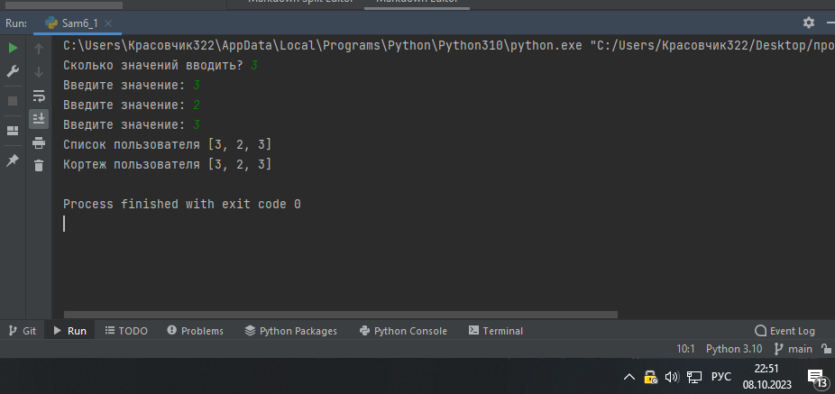
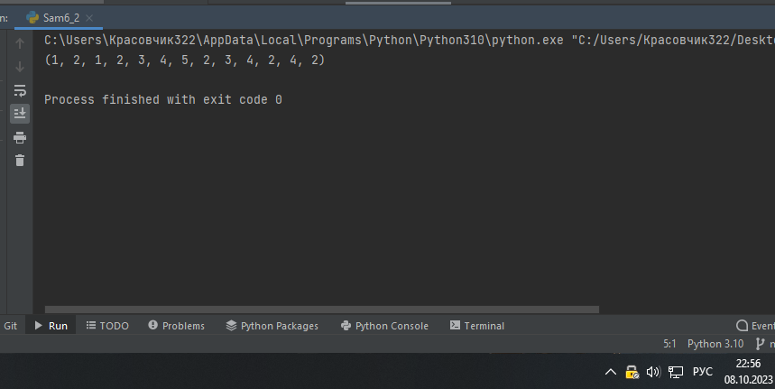
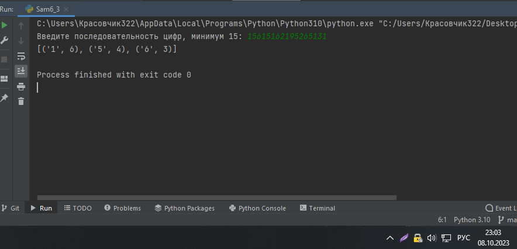
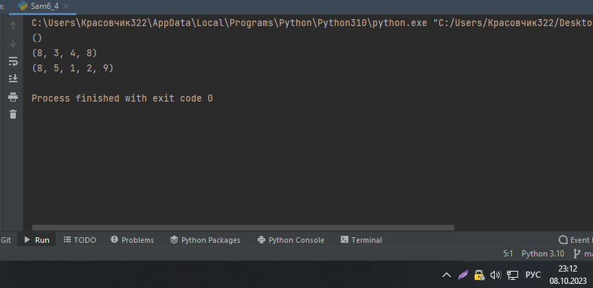
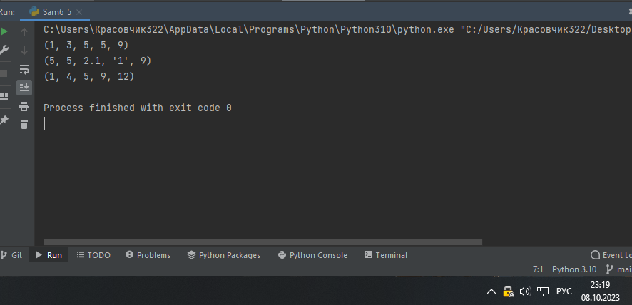

Самостоятельная работа 6


Прокопчук Виталий Сергеевич

ЗПИЭ 20-1


| Задание   | Лаб_раб | Сам_раб |
| ------------------ | --------------- | --------------- |
| Задание 1 | -             | +             |
| Задание 2 | -             | +             |
| Задание 3 | -             | +             |
| Задание 4 | -             | +             |
| Задание 5 | -             | +             |
|                  |               |               |
|                  |               |               |
|                  |               |               |
|                  |               |               |
|                  |               |               |

Работу проверили:

* к.э.н., доцент Панов М.А.

Задание 1

При создании сайта у вас возникла потребность
обрабатыватьданные пользователя в
странной форме, а потом переводить их внужные
вам форматы. Вы хотите принимать от пользователяпоследовательность чисел, разделенных пробелом, а послепереформатировать эти данные в список и
кортеж. Реализуйте вашузадумку.
Для получения начальных данных используйте input().Результатом программы будет выведенный список и кортеж изначальных
данных.

Решение

```
a = int(input("Сколько значений вводить? "))
count = 0
sp1 = []
kor1 = ()

while count < a:
    sp1.append(int(input("Введите значение: ")))
    count += 1

kor1 = sp1
print("Список пользователя", sp1)
print("Кортеж пользователя", kor1)
```



Вывод

Запрашиваем у пользователя сколько будем вводить значений.

Создаем счетчик, пустой список и пустой кортеж.

Запускаем цикл while и начинаем заполнять пустой список.

После заполнения приравниваем получившийся список кортежу.

Задание 2

Николай знает, что кортежи являются неизменяемыми, но
он оченьупрямый и всегда хочет
доказать, что он прав. Студент решилсоздать
функцию, которая будет удалять первое появлениеопределенного элемента из кортежа по значению и возвращатькортеж без него. Попробуйте повторить
шедевр не признающегоавторитеты
начинающего программиста. Но учтите, что Николай невсегда уверен в наличии элемента в кортеже (в этом случае
кортежвернетсяфункцией висходном виде).

Входныеданные:

(1,2,3),1)

(1,2,3,1,2,3,4,5,2,3,4,2,4,2),3)

(2,4,6,6,4,2),9)

Ожидаемыйрезультат:

(2,3)

(1,2,1,2,3,4,5,2,3,4,2,4,2)

(2,4,6,6,4,2)

Решение

```
kor1 = ((1, 2, 3), 1)
kor2 = ((1, 2, 3, 1, 2, 3, 4, 5, 2, 3, 4, 2, 4, 2), 3)
kor3 = ((2, 4, 6, 6, 4, 2), 9)


def foo(tpl, a):
    if not (a in tpl):
        return tpl
    else:
        k = tpl.index(a)
        return tuple(list(tpl)[0:k] + list(tpl[k + 1:]))


print(foo((1, 2, 3, 1, 2, 3, 4, 5, 2, 3, 4, 2, 4, 2), 3))
```



Вывод

Создаем кортеж. Создаем функцию foo с аргументами tpl и a, первый является кортежем из которого нужно будет искать значение, второй само значение которое будем искать.

Устанавливаем условие, если искомого элемента нет то возвращаем исходный кортеж, иначе мы ищем первое появление искомого значения и будем возвращать кортеж без него.

Задание 3

Ребята
поспорили кто из них одним нажатием на numpad наберетбольше повторяющихся цифр, но не понимают, как узнатьпобедителя. Вам им нужно в этом помочь.
Дана строка в видеслучайной
последовательности чисел от 0 до 9 (длина строкиминимум 15 символов). Требуется создать словарь, который вкачестве ключей будет принимать данные
числа (т. е. ключи будуттипом
int), а в качестве значений – количество этих чисел вимеющейсяпоследовательности.Дляпостроениясловаря
создайте функцию, принимающую строку из цифр. Функция
должнавозвратить словарь из 3-х
самых часто встречаемых чисел, такжеэтизначения
нужновывестивпорядкевозрастанияключа

Решение

```
from collections import Counter


def spis(a):
    slovar = {}
    for i in a:
        slovar[i] = slovar.get(i, 0) + 1

    ty = Counter(slovar)

    high = ty.most_common(3)

    return high


a = input("Введите последовательность цифр, минимум 15: ")
if len(a) > 15:
    beta = spis(a)
    print(beta)
else:
    print("Длина строки меньше 15!")

```



Вывод

Импортируем модуль Counter.

Создаем функцию spis. В функции создаем пустой словарь. Запускаем цикл for in в котором к значению каждого ключа словаря мы прибавляем по 1.

создаем переменную ty которая считает наши значения. Переменная high дает нам 3 максимальных отсортированных значений. возвращаем high.

Запрашиваем от пользователя последовательность цифр, задаем условие с проверкой длины, если оно меньше 15 выводим на экран что длина строки меньше 15, если больше то создаем переменную в которой вызываем нашу функцию и печатаем результат.

Задание 4

Ваш хороший друг владеет офисом со входом по электронным

картам, ему нужно чтобы вы написали программу, котораяпоказывала в каком порядке сотрудники
входили и выходили изофиса.
Определение сотрудника происходит по id. Напишитефункцию, которая на вход принимает кортеж и случайный элемент(id),егоможнопридуматьсамостоятельно.Требуетсявернутьновый кортеж, начинающийся с первого
появления элемента в нем изаканчивающийсявторым
егопоявлениемвключительно.

Еслиэлементанетвовсе–вернуть
пустойкортеж.

Если элемент
встречается только один раз, то вернуть кортеж,которыйначинаетсяснегоиидетдоконцаисходного.

Входныеданные:

(1,2,3),8)

(1,8,3,4,8,8,9,2),8)

(1,2,8,5,1,2,9),8)

Ожидаемыйрезультат:

()

(8,3,4,8)

(8,5,1,2,9)

Решение

```
kor1 = ((1, 2, 3), 8)
kor2 = ((1, 8, 3, 4, 8, 8, 9, 2), 8)
kor3 = ((1, 2, 8, 5, 1, 2, 9), 8)


def now(a, b):
    po = b in a
    spis = []
    cout = False
    if po == False:
        ror = ()
        return ror

    for i in a:
        if i == b and cout == True:
            spis.append(i)
            break
        if i == b:
            cout = True
        if cout == True:
            spis.append(i)

    return tuple(spis)


print(now(kor1[0], kor1[1]))
print(now(kor2[0], kor2[1]))
print(now(kor3[0], kor3[1]))

```



Вывод

Создаем 3 кортежа.

Создаем функцию now с двумя аргументами, 1 является кортежем элементов для проверки, 2 кортежем элементов которыми нужно проверять 1 кортеж.

Делаем первую проверку.  Если элемента нет в проверяемом кортеже то вы создаем и возвращаем пустой кортеж. Если елемент имеется то первая проверка ищет этот элемент и записывает его в новый список spis и проходит дальше по кортежу пока не наткнеться еще раз на этот елемент и завершает цикл возвращая нам новый список с нужными элементами который мы перековертируем в кортеж.

Задание 5

Самостоятельно придумайте и решите задачу, в которой
будутобязательно использоваться
кортеж или список. Проведитеминимумтритестадляпроверкиработоспособностивашейзадачи.

Решение

```
# Напишите функцию tpl_sort(), которая сортирует кортеж, состоящий из целых чисел
# по возрастанию и возвращает его. Если хотя бы один элемент не является целым
# числом, то функция возвращает исходный кортеж.


def tpl_sort(tpl):
    for element in tpl:
        if not isinstance(element, int):
            return tpl
    return tuple(sorted(tpl))


# Тесты
print(tpl_sort((5, 5, 3, 1, 9)))
print(tpl_sort((5, 5, 2.1, '1', 9)))
print(tpl_sort((5, 12, 4, 1, 9)))
```



Вывод

Создаем функцию с аргументом для нашего кортежа.

В функции создаем цикл for in в котором делаем первую проверку является ли элемент кортежа типом int, если нет то возвращаем исходный кортеж, иначе просто сортируем данный кортеж
