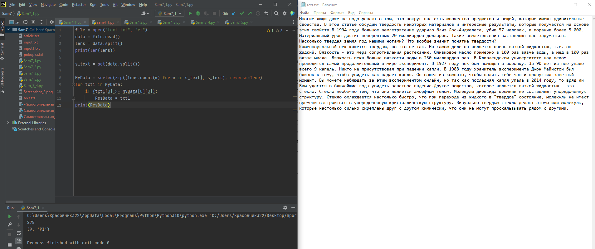
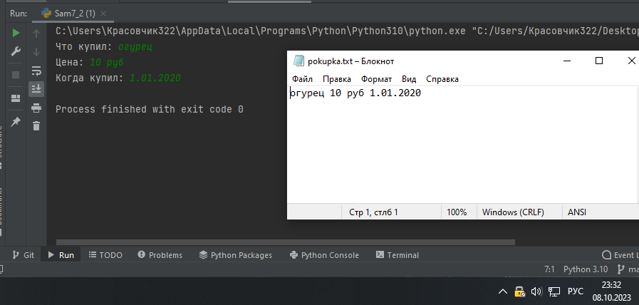
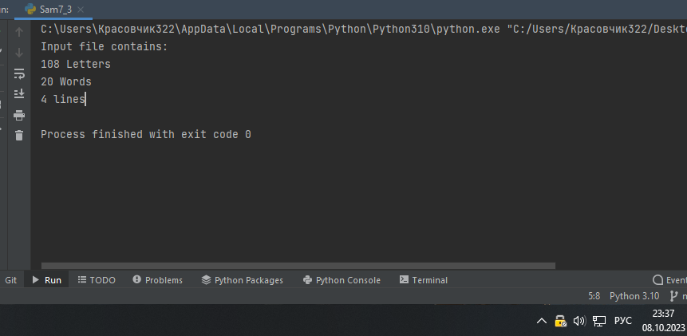
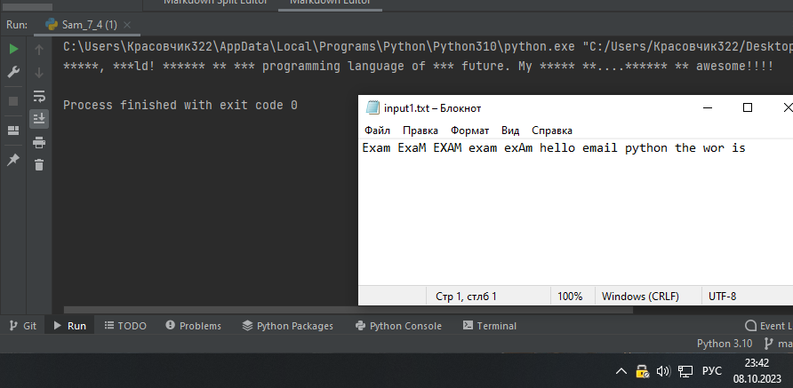
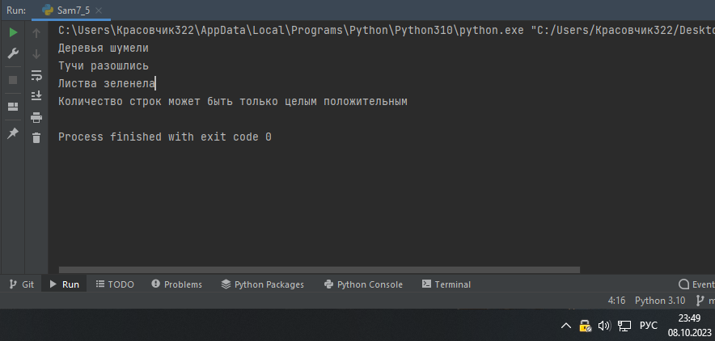

Самостоятельная работа 7

Задание 1

Найдите
в интернете любую статью (объем статьи не менее 200слов), скопируйте ее содержимое в файл и напишите программу,которая считает количество слов в
текстовом файле и определитсамое
часто встречающееся слово. Результатом выполнения задачибудет: скриншот файла со статьей, листинг кода, и вывод в
консоль,вкоторомбудетуказана
всянеобходимаяинформация

Решение 

```
file = open("text.txt", "rt")
data = file.read()
lens = data.split()
print(len(lens))

s_text = set(data.split())

MyData = sorted(zip([lens.count(w) for w in s_text], s_text), reverse=True)
for txt1 in MyData:
    if (txt1[0] >= MyData[0][0]):
        ResData = txt1
print(ResData)
```




Вывод

Открываем  файл text.txt, создаем переменную .read для записи текста и переменную len для посчета слов в тексте.

Создаем переменную MyData в которой будем находить максимально встречающиеся слово в тексте.


Задание 2


У вас появилась потребность в ведении книги расходов,
посмотреввсе существующие варианты
вы пришли к выводу что вас ничего неустраивает
и нужно все делать самому. Напишите программу дляучета расходов. Программа должна позволять вводить информациюо расходах, сохранять ее в файл и выводить
существующие данные вконсоль.Ввод информации происходит через консоль.
Результатомвыполнения задачи будет:
скриншот файла с учетом расходов,листинг
кода, и вывод в консоль, с демонстрациейработоспособностипрограммы.


Решение

```
chtoKupil = input("Что купил: ")
zackok = input("Цена: ")
date = input("Когда купил: ")

pokupka = chtoKupil + " " + zackok + " " + date

file = open("pokupka.txt", "a")
file.write(pokupka)
file.close()

```



Вывод 

Создаем переменные в который запрашиваем у пользователя данные. Далее создаем еще одну переменную в которой все складываем в 1 строку.

Используем функцию open для создания нужного файла и возможность доплнять его. Записываем в файл нашу переменную. Закрываем файл на запись.


Задание 3

Имеется файл input.txt с текстом на латинице. Напишите

программу,которая выводит
следующую статистику по тексту: количество буквлатинскогоалфавита;число
слов; числострок.

·
Текствфайле:Beautiful is better than ugly.Explicit is better than implicit.Simpleisbetterthancomplex.

Complexisbetterthancomplicated.

·
Ожидаемый результат:
Inputfilecontains:

108letters

20words

4lines

Решение

```
letters, words , lines = 0,0,0
for line in open('input.txt'):
    words+=len(line.split())
    letters+=sum(map(str.isalpha, line))
    lines+=1
print('Input file contains:')
print(letters,'Letters')
print(words,'Words')
print(lines,'lines')
```





Вывод

Создаем 3 переменные. Запускаем цикл и открываем файл input.txt, в котором считаем слова, буквы и строки.


Задание 4


Напишите программу, которая получает на вход
предложение,выводит его в терминал,
заменяя все запрещенные словазвездочками

(количество звездочек равно количеству букв вслове). Запрещенные слова, разделенные символом пробела,хранятся в текстовом файле input.txt. Все
слова в этом файлезаписаны в нижнем
регистре. Программа должна заменитьзапрещенные
слова, где бы они ни встречались, даже в серединедругогослова.Замена
производитсянезависимоотрегистра:если файл 

input.txt
содержит запрещенное слово exam, то слова exam,Exam,ExaM,EXAMиexAmдолжныбытьзамененына****.

·
Запрещенныеслова:

helloemailpython
theexamworis

·
Предложениедляпроверки:

Hello, world! Python IS the
programming language of thE future. MyEMAIL
is....

PYTHONisawesome!!!!

Решение

```
text = "Hello, world! Python IS the programming language of thE future. My EMAIL is....PYTHON is awesome!!!!"
with open('input1.txt', 'r') as file:
    spis = file.read().split(' ')
    low = text.lower()

for b in spis:
    low = low.replace(b, '*' * len(b))

res = ''

for i, b in enumerate(low):
    if text[i].lower() == b:
        res += text[i]
    else:
        res += b

print(res)
```




Вывод

Записываем в переменную нужный текст, создаем файл input в который добавляем слова которые необходимо заменить. Создаем список для считывания этих слов. 

Запускаем цикл в котором меняем все значения в нижнем регистре на * 

В следующем цикле меняем запрещеные слова на *


Задание 5


Самостоятельно придумайте и решите задачу, которая
будетвзаимодействоватьстекстовым
файлом.


Решение 

```
Напишите функцию read_last(lines, file), которая будет открывать определенный файл file и выводить на печать построчно последние строки в количестве lines (на всякий случай проверим, что задано положительное целое число).
#Протестируем функцию на файле «article.txt» со следующим содержимым:

#Вечерело
#Жужжали мухи
#Светил фонарик
#Кипела вода в чайнике
#Венера зажглась на небе
#Деревья шумели
#Тучи разошлись
#Листва зеленела
def read_last(lines, file):
    if lines > 0:
        with open(file, encoding='utf-8') as text:
            file_lines = text.readlines()[-lines:]
        for line in file_lines:
            print(line.strip())
        else:
            print('Количество строк может быть только целым положительным')


# Тесты
read_last(3, 'article.txt')
read_last(-5, 'article.txt')
```





Вывод

Написали функцию read_last(lines, file), которая будет открывать определенный файл file и выводить на печать построчно последние строки в количестве lines (на всякий случай проверим, что задано положительное целое число).
