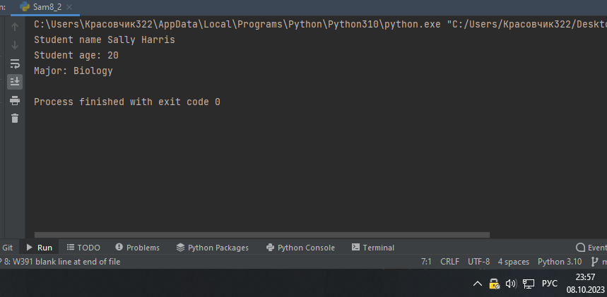
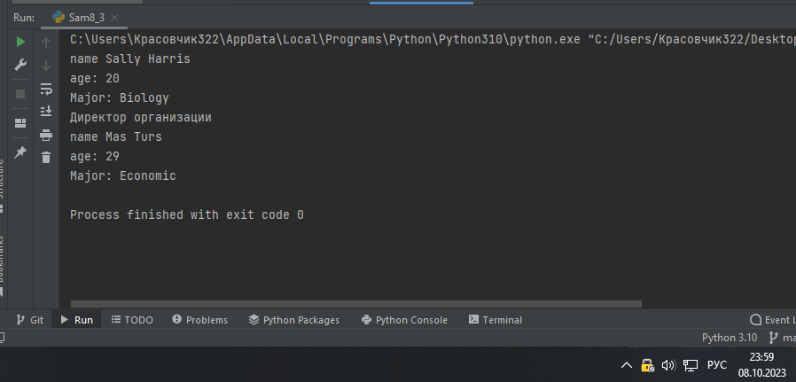
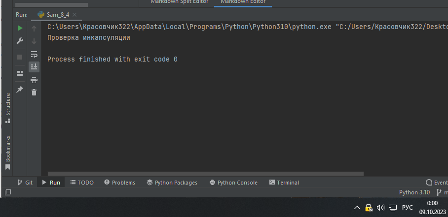
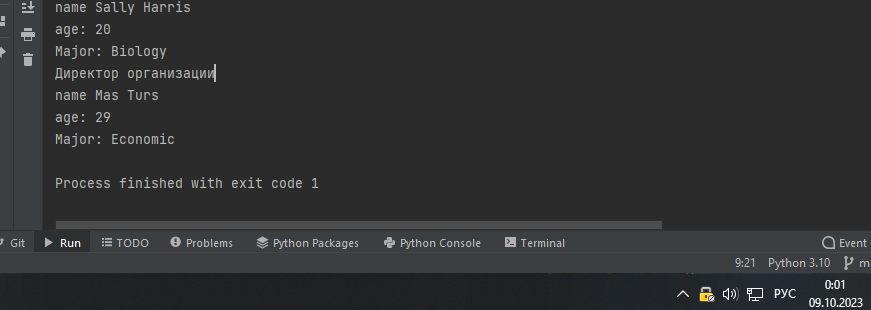

Самостоятельная работа 8


Прокопчук Виталий Сергеевич

ЗПИЭ 20-1


| Задание   | Лаб_раб | Сам_раб |
| ------------------ | --------------- | --------------- |
| Задание 1 | -             | -             |
| Задание 2 | -             | +             |
| Задание 3 | -             | +             |
| Задание 4 | -             | +             |
| Задание 5 | -             | -             |
|                  |               |               |
|                  |               |               |
|                  |               |               |
|                  |               |               |
|                  |               |               |

Работу проверили:

* к.э.н., доцент Панов М.А.

Задание 1

Самостоятельно создайте класс и его объект. Они должныотличаться, от тех, что указаны в
теоретическом материале(методичке) и
лабораторных заданиях. Результатом выполнения
заданиябудетлистинг
кодаиполучившийсявыводконсоли.

Решение

```
class Student:
    def __init__(self, first, last, age, major):
        self.first = first
        self.last = last
        self.age = age
        self.major = major
s = Student('Sally' , 'Harris', 20, 'Biology')
```

Задание 2

Самостоятельно создайте атрибуты и методы для ранее созданногокласса. Они должны отличаться, от тех, что указаны втеоретическом материале (методичке) и

лабораторных заданиях.Результатом
выполнения задания будет листинг кода иполучившийсявывод консоли.

Решение

```
class Student:
    def __init__(self, first, last, age, major):
        self.first = first
        self.last = last
        self.age = age
        self.major = major

    def profile(self):
        print(f"Student name {self.first + ' ' + self.last}")
        print(f"Student age: {self.age}")
        print(f"Major: {self.major}")


s = Student('Sally', 'Harris', 20, 'Biology')

s.profile()

```



Задание 3

Самостоятельно реализуйте наследование, продолжая
работать сранее созданным классом.
Оно должно отличаться, от того, чтоуказано
в теоретическом материале (методичке) и лабораторныхзаданиях. Результатом выполнения задания будет листинг кода иполучившийсявывод консоли.

Решение

```
class Student:
    def __init__(self, first, last, age, major):
        self.first = first
        self.last = last
        self.age = age
        self.major = major

    def profile(self):
        print(f"name {self.first + ' ' + self.last}")
        print(f"age: {self.age}")
        print(f"Major: {self.major}")


s = Student('Sally', 'Harris', 20, 'Biology')

class Direc(Student):
    def ruc(self):
        print("Директор организации")

d = Direc('Mas', 'Turs', 29, 'Economic')
s.profile()
d.ruc()
d.profile()
```



Задание 4

Самостоятельно реализуйте инкапсуляцию, продолжая

работать сранее созданным классом.
Она должна отличаться, от того, чтоуказана
в теоретическом материале (методичке) и лабораторныхзаданиях. Результатом выполнения задания будет листинг кода иполучившийсявывод консоли.

Решение

```
class Student:
    def __init__(self, first, last, age, major):
        self.first = first
        self.last = last
        self.age = age
        self.major = major
        self.__inc()

    def profile(self):
        print(f"name {self.first + ' ' + self.last}")
        print(f"age: {self.age}")
        print(f"Major: {self.major}")


    def __inc(self):
        print("Проверка инкапсуляции")


s = Student('Sally', 'Harris', 20, 'Biology')

```



5 Задание

Самостоятельно реализуйте полиморфизм. Он должен
отличаться,от того, что указан в
теоретическом материале (методичке) илабораторных
заданиях. Результатом выполнения задания будет
листингкодаи получившийся выводконсоли.

```
from Sam8_3 import Student, Direc

s = Student()
d = Direc()

a = s.profile()
b = s.profile()
vse = [a,b]
print(vse)

```


