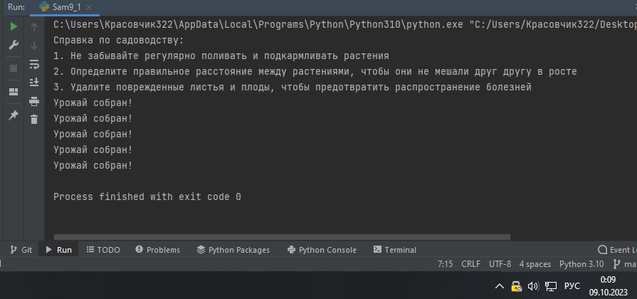

Самостоятельная работа 9


Прокопчук Виталий Сергеевич

ЗПИЭ 20-1


| Задание   | Лаб_раб | Сам_раб |
| ------------------ | --------------- | --------------- |
| Задание 1 | -             | +             |
|                  |               |               |
|                  |               |               |
|                  |               |               |
|                  |               |               |
|                  |               |               |
|                  |               |               |
|                  |               |               |
|                  |               |               |
|                  |               |               |

Работу проверили:

* к.э.н., доцент Панов М.А.

Задание 1

# Лабораторнаяработа

9

**ТЕМА 9. Концепции и принципы ООПЗадания
длясамостоятельноговыполнения:**

Задание
Садовникипомидоры.

# Классоваяструктура:

Есть**Помидор**со
следующимихарактеристиками:

·
Индекс

·
Стадиясозревания(стадии:
отсутствует,цветение,зеленый,
красный)

**Помидор**может:

·
Расти(переходитьнаследующуюстадию
созревания)

·
Предоставлятьинформациюосвоейзрелости

Есть **Кустспомидорами** ,который:

·
Содержит список томатов, которые на нем растутА также может:

·
Растивместестоматами

·
Предоставлятьинформациюозрелостивсехтоматов

·
Предоставлятьурожай

Итакжеесть **Садовник** ,которыйимеет:

·
Имя

·
Растение, за которым он ухаживаетОнможет:

·
Ухаживатьзарастением

·
Собиратьснегоурожай

# Задание:

Класс **Tomato** :

**1)     **Создайтекласс**Tomato**

Создайте статическое свойство  **states** , которое будет содержать всестадиисозревания
помидора

**3)     **Создайтеметод     **init    ()** ,
внутри которого будут определены двадинамическихсвойства: **_index** (передаетсяпараметром)и**_state**

(принимает
первое значение из словаря  **states** ).
После написанияэтого блока кода в
комментарии к нему укажите какими являются
эти два свойства

Создайте метод  **grow()** ,
который будет переводить томат наследующую
стадиюсозревания

Создайте метод  **is_ripe()** ,
который будет проверять, что томат созрелКласс **TomatoBush** :

**1)
**Создайтекласс**TomatoBush**

**2)     **Определитеметод     **init    ()** ,
который будет принимать в качествепараметра
количество томатов и на его основе будет создаватьсписок объектов класса  **Tomato** .
Данный список будет хранитьсявнутридинамическогосвойства**tomatoes**

Создайте метод  **grow_all()** ,
который будет переводить все объектыизсписка
томатовнаследующийэтап созревания

Создайте метод  **all_are_ripe()** ,
который будет возвращать  **True** , есливсетоматы
изсписка стали спелыми.

Создайте метод  **give_away_all()** ,
который будет чистить списоктоматовпосле сбора урожая

Класс **Gardener** :

**1)     **Создайтекласс**Gardener**

Создайтеметод     **init    ()** , внутри которого будут определены
двадинамических свойства:  **name ** (передается параметром, являетсяпубличным) и  **_plant ** (принимает объект класса  **TomatoBush** ). Посленаписания
этого блока кода в комментарии к нему укажите какимиявляютсяэтидва свойства

Создайте метод  **work()** ,
который заставляет садовника работать, что
позволяетрастению
становитьсяболее зрелым

Создайте метод  **harvest()** ,
который проверяет, все ли плоды созрели.Если
все, то садовник собирает урожай. Если нет, то метод печатаетпредупреждение

Создайте статический метод  **knowledge_base()** , который выведет вконсольсправку по
садоводству

Тесты:

Вызовитесправкупосадоводству

**2)     **Создайтеобъекты
классов**TomatoBush**и**Gardener**

Используя объект класса  **Gardener** , поухаживайте за кустом с
помидорами

Попробуйте собрать урожай, когда томаты еще не
дозрели.Продолжайтеухаживать заними

Соберитеурожай

Результатом
работы вашей программы будет листинг кода с подробнымикомментариями и скриншотывыполенниявсехтестов.

Решение

```

    def grow(self):
        if self._state < 3:
            self._state += 1

    def is_ripe(self):
        return True if self._state == 3 else False


class TomatoBush:

    def __init__(self, num):
        self.tomatoes = [Tomato(index) for index in range(1, num + 1)]

    def grow_all(self):
        for tomato in self.tomatoes:
            tomato.grow()

    def all_are_ripe(self):
        return all([tomato.is_ripe() for tomato in self.tomatoes])

    def give_away_all(self):
        self.tomatoes = []


class Gardener:

    def __init__(self, name, plant):
        self.name = name
        self._plant = plant

    def work(self):
        self._plant.grow_all()

    def harvest(self):
        if self._plant.all_are_ripe():
            print('Урожай собран!')
            self._plant.give_away_all()
        else:
            print('Томаты еще не дозрели')

    @staticmethod
    def knowledge_base():
        print('Справка по садоводству:')
        print('1. Не забывайте регулярно поливать и подкармливать растения')
        print('2. Определите правильное расстояние между растениями, чтобы они не мешали друг другу в росте')
        print('3. Удалите поврежденные листья и плоды, чтобы предотвратить распространение болезней')


# Вызов справки по садоводству
Gardener.knowledge_base()

# Создание объектов классов TomatoBush и Gardener
bush = TomatoBush(5)
gardener = Gardener('John', bush)

# Уход за кустом с помидорами
gardener.work()
gardener.work()
gardener.work()

# Сбор урожая
gardener.harvest()

# Продолжение ухода за кустом, пока томаты не дозреют
gardener.work()
gardener.harvest()
gardener.work()
gardener.harvest()
gardener.work()
gardener.harvest()
# Сбор урожая после дозревания всех томатов
gardener.work()
gardener.harvest()
```


